# git-learning


----
# Table of Contents
1. [Setting your environment](#1-setting-your-environment)
2. [Working locally](#2-working-locally)
   1. [Starting with git](#21-starting-with-git)
   2. [Tracking files](#22-tracking-files)
   3. [Log & alias](#23-log--alias)
   4. [HEAD, relative references & branch creation and repositioning](#24-head-relative-references--branch-creation-and-repositioning)
   5. [Diff & blaming](#25-differences--blaming)
   6. [Stashing](#26-stashing)
   7. [Rollback changes](#27-rollback-changes)
   8. [Amending](#28-amending)
   9. [Cherry-picking](#29-cherry-picking)
   10. [Branch integration (merge & rebase)](#210-branch-integration-merge--rebase)
3. [Working with remotes](#3-working-with-remotes)
   1. [Cloning a remote repository](#31-cloning-a-remote-repository)
   2. [Working with others 1 (fetching)](#32-working-with-others-1-fetching)
   3. [Working with others 2 (pull-push)](#33-working-with-others-2-pull-push)
   7. [Pull Requests (PRs)](#34-pull-requests-prs)
   4. [Multiple remotes (forking)](#35-multiple-remotes-forking)
   5. [Force push](#36-force-push)
   6. [Tracking your branches](#37-tracking-your-branches)
----
## 0. Cheatsheet
We use some [mermaid] graphs, only visible in GitHub (you will see only code in local)
<!--https://mermaid-js.github.io/mermaid-live-editor-->
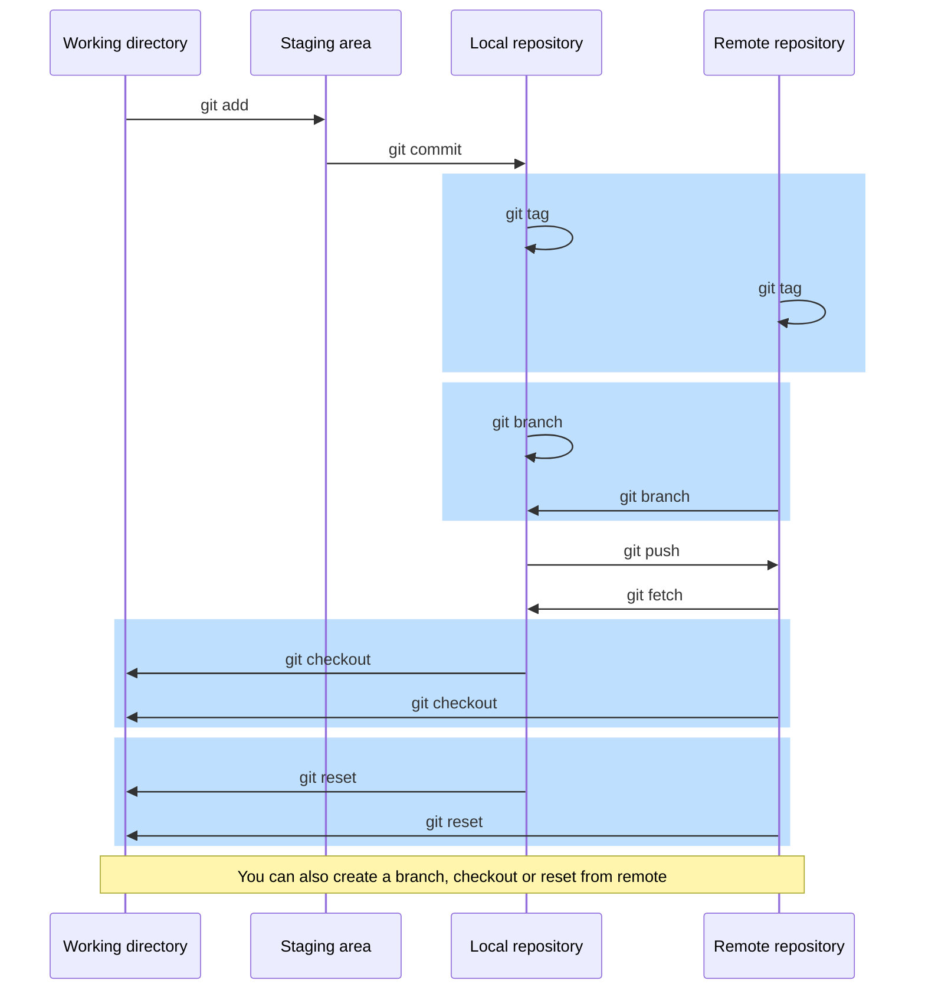

If there is any word or concept you do not understand you should take a look at [git glossary].

## 1. Setting your environment


We will use [docker],[^docker] so we can have the same isolated environment:

> **Note:** ⚠️ You will need some data of this repo, so you may:
> 1. Download `docker` folder
> 2. Or clone this repo: `git clone https://github.com/hablatraining/git-learning.git`

```bash
# Enter to docker folder, previously downloaded
cd docker/
docker build . -t training/git
# If you are not familiar with docker, -v will create a volume inside the docker directory.
#     Whatever you create inside your docker container at projects folder will be at this volume too,
#     so you can see your files and repos from your computer or git clients.
# You may want to delete this argument or change it according your needs.
docker run -it -d -v $(pwd)/git-volume/:/root/projects/ --name learning-git training/git:latest
# Use this command to "enter" your docker container whenever you want
docker exec -it learning-git bash
```
Now, inside your docker, got to **projects/local** folder: `cd projects/local`

> **Note:** Each section will have a synopsis (ℹ️⚡ℹ️) of the commands with some useful arguments.
> However, there are more arguments, for more information visit the links of each command.
----

## 2. Working locally

### 2.1 Starting with git


We will see the following commands to begin with git:
1. The [git config] command let us add, remove and show some configurations to customize the way you work with git.
   <details><summary>ℹ️⚡ℹ️ Synopsis</summary>

   ```bash
   git config [--<scope>] [--show-origin] <name> [<value> [<value-pattern>]]
   git config [--<scope>] --add <name> <value>
   git config [--<scope>] --unset <name> [<value-pattern>]
   git config [--show-origin] [--show-scope] -l | --list
   git config [--<scope>] -e | --edit
   ```
   </details>


2. The [git init] command creates an empty local git repository. An initial branch without any commits and `.git` folder will be created, where the local git config will be saved.

   <details><summary>ℹ️⚡ℹ️ Synopsis</summary>

   ```bash
   git init [-b <branch-name> | --initial-branch=<branch-name>]
            [<directory>]
   ```
</details>

3. The [git add] command updates the internal git index so the given files will be tracked and prepared to be "committed". A file that has being "added" is also known as a staged file.

   <details><summary>ℹ️⚡ℹ️ Synopsis</summary>

   ```bash
   git add [--verbose | -v] [--interactive | -i] [--patch | -p] [--edit | -e]
           [--] [<pathspec>...]
   ```
   </details>

4. The [git commit] command is the one which actually saves the **staged** files.
When you create a new commit you will save the following info among others:
   * The actual changes (only the differences)
   * Who performed the commit
   * When the commit was created
   * The commit parent
   * etc

   <details><summary>ℹ️⚡ℹ️ Synopsis</summary>
   
   ```bash
   git commit [-a | --all] [--interactive] [-p | --patch]
              [-v | --verbose] [--amend] [-m | --message <msg>]
              [--] [<pathspec>...]
   ```
   </details><br>

<details><summary>🚧Let's practice</summary>

```bash
mkdir -p -v projects/local
cd projects/local
ls -l
# First of all, let's say to git who we are and which name should it display
git config --global user.email eduardo.ruiz@hablapps.com
git config --global user.name "Eduardo Ruiz Alonso"

# We can view all the configs anytime
git config --list

# There are some other interesting configs, you will see its potential eventually
git config --global init.defaultBranch main

# Now that git has the minimum configuration, let's start a new project
git init
echo -e "# This is my git project\n" > README.md
echo -e "Cheatsheet: https://devhints.io/git-log-format\n\n" >> README.md
# Now that we have made some changes we will prepare this file to be "saved"
git add .
# The file is prepared and "tracked" by git, now we are going to save it's first version
git commit -m "Initial commit"

# Just for you to know, in the first steps we added global configs, but you
#   could also set some local configurations. This means that every repo in
#   this computer will read the global config, but this very repo will have
#   a different configuration.
# Here we will set the same email, but different name, just for learning purposes.
git config user.email eduardo.ruiz@hablapps.com
git config user.name "Eduardo Ruiz"

# Adding some arguments, you could see "where" are the configurations located.
git config --list --show-origin
```
</details>

### 2.2 Tracking files


The [git status] command shows the differences between the current local repository and the current HEAD commit.
This means, it will show which files have been modified, added or deleted, and it's git state (untracked, modified, deleted, etc.)
<details><summary>ℹ️⚡ℹ️ Synopsis</summary>

```bash
git status [-s | --short] [-b | --branch] [--show-stash]
           [-u[<mode>] |--untracked-files[=<mode>]] [--ignored]
           [--] [<pathspec>...]
```
</details>
<details><summary>🚧Let's practice</summary>

```bash
# Let's create a new file, which will be untracked, as it has just been created.
echo "this is a test" > test.txt
# If we execute the git status command, we will see this file as "Not staged"
git status
# Now let's modify a previously tracked file (README.md) and "track" the new file
echo "-----" >> README.md
git add test.txt
# After execute git status we will see the new file as "Changes to be committed"
#    We will also see the README.md file as "not staged", because we made some
#    some changes and they also have to be prepared to be "saved"
git status

# Let's create a new commit, but this time we will use a new argument which will
#    help us to avoid the git add command.
#    If we execute this command with -a argument, tracked files will be automatically staged
git commit -a -m "commit 2"   ## -a ==> ONLY TRACKED FILES
# As we committed everything, git status will show us nothing.
git status

# We have a special file called .gitignore, which will tell git to avoid tracking some files and folders
touch .gitignore
touch .testing
# If we execute git status it will show us both new files
git status
# As .gitignore file is new, it is not being tracked, so let's track it and add config
#   git to ignore "hidden" files (starting with a dot)
git add .gitignore
echo ".*" >> .gitignore
# After executing git status, we will see the tracked .gitignore file, but we will also see changes
#   over this same file that are not (yet) prepared to be committed.
#   Don't you miss something?
#   Exactly, the .testing file disappeared! But if you go to the folder and list everything you will see it.
#   This is happening because this file is being ignored by git, so it simply does not exist for it.
#   Usually ignored files are logs, personal config IDE files... Everything you should not share.
git status
ls -la

# Now that we know how to ignore files let's ignore a also a folder
mkdir secrets
touch secrets/secret1.txt
touch secrets/secret2.txt
# Here we can see a new untracked folder
git status
# Using -u argument is like using --untracked-files=all, so it will show individual files in untracked folders
git status -u
# Now we are using just a few files, but in a real project you could update several files at the same time.
#   Adding -s argument will summarize them in a simple view. Also --ignored files could help you to see ignored files.
git status -u -s -b --ignored
echo "secrets/*" >> .gitignore
git status
git commit -am "gitignore"

# Let's see a common use case. Imagine you create a new test file
touch test.scala
# But, when you execute your test, it creates a log file you don't realize.
echo "2022-04......" > myTest.log
# You think you have finished your work, and you only have created a test file... So you add everything and commit it.
git add .
git commit -m "add script"
# Eventually you realize that there are some files that shouldn't be there (in this case, the log file).
#   As I told you... If I want to ignore a file I simply add it in our .gitignore file, so let's do it.
echo "*.log" >> .gitignore
# If we create a new log file it will be ignored
touch myLog.log
git commit -am "ignore log files"
# Everything looks fine, doesn't it? So you just execute the test, updating the log file...
echo "2022-05......" > myTest.log
# And you see how your repo is going using git status...
git status
# Why the f*%k the log file is still there?!?
# Simple: we added the config to ignore .log files... But this file was being tracked before we added this config.
# This log file was part of the repository, it is in the git history, so git keeps tracking it.
# We have to remove it from the tracking history.
# In order to ease this step and learn a something new, let's discard the not saved changes
git checkout .
# Now, let's untrack the log file and see what we have done
git rm --cached myTest.log
git status
# Git status show us that we deleted the file, BUT, if you take a look, the file is still there.
#   This means exactly the same we saw before, the file exists, but it doesn't for git.
ls -l
# If we "save" this new state "removing" the file, future changes will not be tracked.
git commit -m "untrack myTest.log"

# WARNING!: This steps allow us to stop tracking files, BUT the files remain in the git history.
#   We will see the git history in detail in the next sections.
#   If you want to completely remove a file from the git history, this steps are not what you are looking.
```
</details>

### 2.3 Log & alias
The [git log] command shows the git commit history.
This command is highly customizable, you can limit the number of commits, select a range, show it like a tree format, etc.

<details><summary>ℹ️⚡ℹ️ Synopsis</summary>

```bash
git log
      [<options>]
        [--graph] [--abbrev-commit] [--decorate]
        [-n <number> | -<number>] [--format='<format>']
        [--all] [--branches=<pattern>] [--no-merges]
      [<revision-range>]
      [[--] <path>...]
```
</details>
<details><summary>🚧Let's practice</summary>

```bash
echo "Something" >> README.md
git add .
git config --global alias.unstage 'reset --'
git config --global alias.discard 'checkout --'
git config --global alias.st 'status --short --branch --untracked-files=all --ignored'

git st
git unstage README.md
git st
git discard README.md
git st

git log
git log -n 1
git config --global alias.logtree "log --graph --abbrev-commit --decorate --format=format:'%C(bold blue)%h%C(reset) - %C(bold cyan)(%ar|%cr)%C(reset) %C(bold yellow)%d%C(reset) %C(white)%s%C(reset) %C(dim green)- %an%C(reset)' --all"
git logtree
```
</details>

> 🎁♻️ **_Cool alias:_** `git config --global alias.unstage 'reset --'`<br>
> 🎁♻️ **_Cool alias:_** `git config --global alias.discard 'checkout --'`<br>
> 🎁♻️ **_Cool alias:_** `git config --global alias.untrack 'rm --cached'`<br>
> 🎁♻️ **_Cool alias:_** `git config --global alias.logtree "log --graph --abbrev-commit --decorate --format=format:'%C(bold blue)%h%C(reset) - %C(bold cyan)(%ar|%cr)%C(reset) %C(bold yellow)%d%C(reset) %C(white)%s%C(reset) %C(dim green)- %an%C(reset)' --all"`<br>
> 🎁♻️ **_Cool alias:_** `git config --global alias.st 'status --short --branch --untracked-files=all --ignored'`<br>
> 🎁♻️ **_Cool alias:_** `git config --global alias.recent 'branch --format="%(HEAD) %(color:yellow)%(refname:short)%(color:reset) - %(contents:subject) %(color:green)(%(committerdate:relative)) [%(authorname)]" --sort=-committerdate'`<br>
> 🎁♻️ **_Cool alias:_** `git config --global alias.save 'stash push --all'`<br>

### 2.4 HEAD, relative references & branch creation and repositioning


The [git branch] command list or manage branches.
<details><summary>ℹ️⚡ℹ️ Synopsis</summary>

```bash
git branch [--format=<format>]
           [(-r | --remotes) | (-a | --all)]
           [--list] [<pattern>...]
git branch [-f] <branchname> [<start-point>]
git branch (--set-upstream-to=<upstream> | -u <upstream>) [<branchname>]
git branch --unset-upstream [<branchname>]
git branch (-m | --move   | -M) [<oldbranch>] <newbranch>
git branch (-c | --copy   | -C) [<oldbranch>] <newbranch>
git branch [-d | --delete | -D] <branchname>...
```
</details>

The [git checkout] command let us move between branches and restore files (discarding not committed changes).
<details><summary>ℹ️⚡ℹ️ Synopsis</summary>

```bash
git checkout [<branch>/<commit>]
git checkout [[-b|-B] <new-branch>] [<start-point>]
git checkout (-p|--patch) [--] [<pathspec>...]
```
</details>
In git, you are always somewhere in the git history. That means, you are always seeing a commit, in the git history.
**HEAD** is the pointer to the current commit you are viewing. Every time you switch from one branch to another,
your **HEAD** moves from one branch to the other.

Now we know the concept of branch & HEAD, we will see how to switch from/to them.
But what if I want to position git to two commits before "main"? Do I need to show the log
and create a new branch from the commit I copy/paste?
No need for that, we can also move from git history using "~" and "^" characters.

When we use "~" character we mean "the first father of". We can tell git where we start looking and how many commits
behind should we reposition our HEAD. This means:
* `HEAD~` --> The first parent of HEAD
* `main~~` --> Two parents behind main
* `main~4` --> Four parents behind main, === `main~~~~`

When we use "^" character we also mean "the first father of", but in a non-linear way.
It is usually used on merge commits, because in git we can have several parents (usually two).
This means:
* `HEAD^` --> The first parent of HEAD, === `HEAD~` for a commit with only one parent
* `main^^` --> Two parents behind main, === `main~~` === `main~2` for commits with only one parent
* `main^2` --> The second parent from main =!= `main~2` ⚠️

We can also Take a look to the following examples:

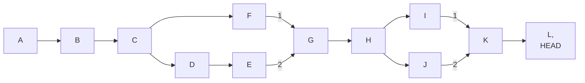

|   Example   | Result                                                                 |
|:-----------:|------------------------------------------------------------------------|
|   `HEAD^`   | <details><summary>Solution</summary> is the `K` commit </details>      |
|  `HEAD~1`   | <details><summary>Solution</summary> is also the `K` commit </details> |
|  `HEAD^^`   | <details><summary>Solution</summary> is the `I` commit </details>      |
|  `HEAD~^`   | <details><summary>Solution</summary> is also the `I` commit </details> |
|  `HEAD~2`   | <details><summary>Solution</summary> is also the `I` commit </details> |
|  `HEAD~^2`  | <details><summary>Solution</summary> is the `J` commit </details>      |
|  `HEAD~^^`  | <details><summary>Solution</summary> is the `H` commit </details>      |
|  `HEAD~3`   | <details><summary>Solution</summary> is also the `H` commit </details> |
| `HEAD~4^~`  | <details><summary>Solution</summary> is the `C` commit </details>      |
| `HEAD~4^2~` | <details><summary>Solution</summary> is the `D` commit </details>      |


The [git tag] command let us manage special references called tags.
You may wonder what's the difference between branches and tags: both references
some point of the git history, but branches are "active" lines of development
while tags do not evolve and are used to mark special moments of the git history,
like a release version.

<details><summary>ℹ️⚡ℹ️ Synopsis</summary>

```bash
git tag [-a] [-f] [-m <msg>] <tagname> [<commit> | <object>]
git tag -d <tagname>...
git tag -l | --list [-i | --ignore-case] [--sort=<key>] [--format=<format>] [<pattern>...]
```
</details>

<details><summary>🚧Let's practice</summary>

```bash
# With the next command we will create a new branch called "branch1" from HEAD
git branch branch1
# If we don't specify any argument, it will list local branches
git branch
# Checkout command allow us to move from our current branch to "branch1"
git checkout branch1
# If we list again current branches you will se now there is an indicator at "branch1"
git branch
# We can also create a new branch using checkout command if we use -b argument
git checkout -b branch2
git branch
git logtree

# Let's create one commit for each branch and unify them (merge) so we can see some relative positions
echo "commit 3" >> README.md
git commit -am "commit 3"
git checkout branch1

echo "commit 4" > tests.txt
git add tests.txt
git commit -m "commit 4"
# Let me use the merge command, but we will see it  in detail on a further section
git merge branch2
git logtree

# Now that we have "branch2" with a single commit, and "branch1" with it's own commit and a new commit
#     coming from "branch2", we can do interesting things to create new branches from relative positions.
# First of all, let's create a branch called "ref"
git branch ref
# We can also create a branch from other branch
git branch ref2 main
# But what if we already have a branch and it is not in the correct position?
# We can "move" the reference of a branch so we can reposition that branch.
# To achieve that, we have to use -f flag. That means we FORCE the creation of a branch
#   somewhere in the git history, if the branch exists, overwrite it.
git branch ref main # This will fail, for ref already exists.
git branch -f ref ref
git logtree

# We can also create branches from relative positions
git checkout main
git branch -f ref HEAD~1
git branch -f refParen1 main^1
git branch -f refParen2 main^2
git logtree

# Or even from a commit hash or any other reference
git branch newBranch commit_hash
git logtree

# Let's conclude this section watching tags in action.
# using git tag command we can create a tag from HEAD
git tag v0.0.2
# But we can also create a tag anywhere from the git history using branch names, relative references, commit hashes, etc.
git tag v0.0.1 main~3
# Using git tag command without arguments we can list our local tags
git tag
# This command let us sort and filter tags as well
git tag -l --sort=-creatordate --format='%(creatordate:short):  %(refname:short)'
# Or you can use git log
git log --no-walk --tags --pretty="%ai || %h || %an ||%d" --decorate=full
# The same way we can create a branch from another branch, we can create a branch from a tag
git branch release/v0.0.1 v0.0.1
git logtree
```
</details>

> 🎁♻️ **_Cool alias:_** `git config --global alias.backup "branch backup/$(git rev-parse --abbrev-ref HEAD)"`<br>
> 🎁♻️ **_Cool alias:_** `git config --global alias.backupf "branch -f backup/$(git rev-parse --abbrev-ref HEAD)"`<br>

### 2.5 Differences & blaming

The [git diff] command show changes between commits, branches, etc.
<details><summary>ℹ️⚡ℹ️ Synopsis</summary>

```bash
git diff [<options>] [--cached/--staged] [<commit>] [--] [<path>...]
git diff [<options>] <commit>...<commit> [--] [<path>...]
git diff [<options>] <blob> <blob>
```
</details>

The [git blame] command show the commit, when and who last modified each line of a file.
<details><summary>ℹ️⚡ℹ️ Synopsis</summary>

```bash
git blame [-e] [-w]
          [-L <range>] [--since=<date>]
          [--color-lines] [--color-by-age]
          [--] <file>
```
</details>

<details><summary>🚧Let's practice</summary>

```bash
# We have seen the git status command, which show you the files that has been modified, but not committed.
# Now that we know the modified files... What are the changes?
git checkout main
# What if we use git diff and we have no changes?
git status -s
git diff
# Yes, nothing happens, because nothing is different from our HEAD
# Let's make some changes and see what happens
echo "Lorem ipsum dolor sit amet, consectetur adipiscing elit." > lorem_ipsum.txt
echo "Vivamus a odio pharetra, tempus felis vitae, vestibulum neque." >>  lorem_ipsum.txt
git status -s
git diff
# Got you! Probably you expected to see the new file, but it is notin the git history and not even being tracked, so there is no diff for git to compare from.
# But, what if we add the file, so the file is being tracked?
git add .
echo "Donec dignissim varius massa, vel lobortis eros tincidunt ut." >> lorem_ipsum.txt
git status -s
git diff
# Great, git diff "works" now, but only shows as difference the new line and the file is whole new.
# Yet again, when we added the new file we started tracking it, so git shows us the difference from tracked and untracked changes
# Now I wonder what would happen if I commit my current added changes and add the third line afterwards.
git commit -m "lorem ipsum"
git status -s
git diff
git add .
git status -s
git diff
# Nothing... Did I mocked you? Not quite, but we have to see how this works.
# git diff has an argument to show the staged differences
git diff --staged # --cache is a synonym of --staged
# Yes!!! Now I can see the differences including staged files?
# It worked!! Or did it not?
# What if I add a new untracked line?
echo "Suspendisse sed tincidunt enim. Nullam at ultrices tortor." >> lorem_ipsum.txt
git diff --staged
git diff
# Each command shows a part of the same thing? Yes it does.
# Fortunately, we have a few tricks to work this out.
# We can specify a git reference to compare from
git diff HEAD
# If we want to see more info, like which changes have been added and which not.
git status -vv

# Let's save our work and make more changes
git commit -am "lorem ipsum 2"
echo "Etiam convallis tempus maximus. Praesent convallis hendrerit ipsum sit amet mollis." >> lorem_ipsum.txt
echo "Fusce semper eleifend consectetur. Mauris facilisis neque sem, imperdiet posuere arcu posuere vitae." >> lorem_ipsum.txt
echo "Fusce nec nibh et magna lacinia sagittis. Ut ut faucibus felis." >> lorem_ipsum.txt
# The same way we use git diff to compare from HEAD, we can compare our differences from any git reference
git diff HEAD
git diff HEAD~ # Here we can see our local changes and the changes made the commit we just created a moment ago

# Let's complicate a bit this situation... Now we only have one file with changes, but what if we have several modifications?
git checkout .
echo "Etiam convallis tempus maximus. Praesent convallis hendrerit ipsum sit amet mollis." >> lorem_ipsum.txt
echo "file11" > file1.txt
echo "file21" > file2.txt
echo "file31" > file3.txt
git add .

echo "Fusce semper eleifend consectetur. Mauris facilisis neque sem, imperdiet posuere arcu posuere vitae." >> lorem_ipsum.txt
echo "Fusce nec nibh et magna lacinia sagittis. Ut ut faucibus felis." >> lorem_ipsum.txt
echo -e "file12\nfile13\nfile14" >> file1.txt
echo -e "file22\nfile23\nfile24" >> file2.txt
echo -e "file32\nfile33\nfile34" >> file3.txt
# Having multiple files, git diff could be a bit tedious, but we can show only the diff of a single file
git diff HEAD file1.txt

# But we should not stop here, we can compare the differences between commits, branches, etc.
git diff HEAD~2 HEAD~
git diff HEAD~2 HEAD~ README.md # This will show nothing, for this file was not changed

# Let's clean
git unstage file*
rm file*
git commit -am "lorem 3"

# Usually, a file in git suffers several modifications as the development evolves.
# So, probably, if a file contains 500 lines, it should have been added/updated several times throughout the git history.
# If a find some error... Do I have to use the git log and show the differences for every version
#   until I find who and why that change was made?
# git blame/annotate will help us to do so. This commands will show the last commit which modified each line.
git blame lorem_ipsum.txt
git annotate lorem_ipsum.txt
```
</details>

### 2.6 Stashing


The [git stash] command saves our working changes into a "temporal commit".

<details><summary>ℹ️⚡ℹ️ Synopsis</summary>

```bash
git stash list [<log-options>]
git stash show [-u|--include-untracked|--only-untracked] [<diff-options>] [<stash>]
git stash drop [-q|--quiet] [<stash>]
git stash ( pop | apply ) [-q|--quiet] [<stash>]
git stash branch <branchname> [<stash>]
git stash [push [-p|--patch] [-S|--staged]
          [-u|--include-untracked] [-a|--all] [-m|--message <message>]
          [--] [<pathspec>...]]
git stash clear
git stash create [<message>]
```
</details>

<details><summary>🚧Let's practice</summary>

```bash
# In order to see why we may need the git stash command let's create a branch and make some changes.
git checkout -b feature/myFeature
echo "some changes" >> README.md
# We just created a branch from main, so we can move from/to main freely, because we are at the same point.
git checkout main
# Consider you save your changes, so main now is a commit ahead from our branch...
# Let's switch back and make other changes, in the same position
git commit -am "main changes"
git checkout feature/myFeature
echo "other changes" >> README.md
# What so you think it will happen if we try to switch back to main?
git checkout main
# As you have noticed, our last command failed. We have some working changes and, at the same time, we are trying to move to other branch,
#   but this branch has other modifications at the same line, so git does not know if you want to discard
#   your working changes and keep the line at head, or to overwrite the "main" modification with your working changes.
git st
# Imagine this is not a finished development, but you still want to go to main to, I don't know, to review something before continuing.
# git stash helps us to save temporarily our work, so our working directory will be clean and we could switch branches.
git stash
git checkout main
# Eureka! git saved our changes and we could switch branches.
git checkout feature/myFeature
# But where are my changes? If I use git log I can't see them
git log -n 1
# As we talked before, stash saves a special temporal "commit", so it is not in the git history.
# We can list our stashes using the following command
git stash list

# git stash command saves this changes in a pile, named stash@{n}, where n is the position in the pile.
# Using pop git will extract the saved changes to our working directory and delete this stash reference
git stash pop stash@{0}
git stash list
# Let's save it again so we can practice other commands
git stash
# If we want to extract our stash, but not to delete the stash reference we could use apply (this is useful
#     if we suspect the stash may conflict with our HEAD)
git stash apply stash@{0}
# Let's delete this changes and make a new one to see how a new stash will look
git checkout .
echo "other changes2" >> README.md
git stash
# We now have two elements in our stash pile, so the new stash will be stash@{0}, and the previous stash will be stash@{1}
git stash list
# Please, do not trust me, let's check it out
git stash show -p stash@{0}
git stash show -p stash@{1}

# We can also save stashes with a message so it will be easier to know what we were doing
git stash apply stash@{0}
git stash -m "WIP feature my stash"
git stash list
# We can delete our stashes anytime using drop
git stash drop stash@{0}
# If we do not specify any stash, it will use the last one (stash@{0})
git stash show -p
```
</details>

### 2.7 Rollback changes


The [git revert] command takes back the modifications made by some commit or commits.
It also discards added changes (we have been used this command as the `unstage` alias).

<details><summary>ℹ️⚡ℹ️ Synopsis</summary>

```bash
git revert [--no-edit] [-n | --no-commit] [-m parent-number] <commit>...
git revert (--continue | --skip | --abort | --quit)
```
</details>

The [git reset] command repositions our HEAD to the given reference.

⚠️ This command rewrites the git history, so be careful when using it.

<details><summary>ℹ️⚡ℹ️ Synopsis</summary>

```bash
git reset [--patch | -p] [<tree-ish>] [--] [<pathspec>...]
git reset [--soft | --mixed | --hard] [<commit>]
```
</details>

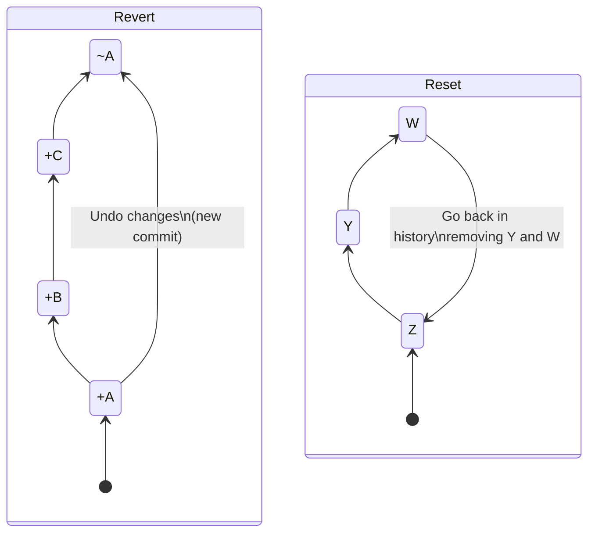

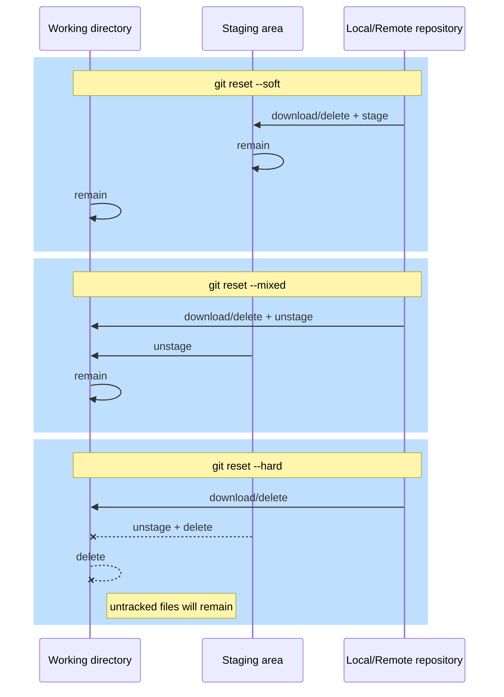

<details><summary>🚧Let's practice</summary>

```bash
# First of all we will make some commits, as if we were developing and accidentally messed up
git checkout -b reverts main
echo -e "\n\nthis will not fail\n" >> README.md
git commit -am "this will not fail"
echo -e "\n\nbut this one will\n" >> README.md
git commit -am "but this one will"
git logtree
# We have saved our work and now we see we did something completely wrong.
# We need to fix it, but it will take time to know what is happening, and fix it,
#     we can't block our mates while we resolve this problem... So we "commit back" our blunder
git revert HEAD
git logtree
git show HEAD
# Like other commands, we can tell to git any kind of reference to revert
git revert --no-commit main..main~
git logtree
# But what happens when we try to revert something and we get a conflict or it simply fails?
git checkout main
git revert reverts~2
# We tried to revert a commit that made changes that we do not have, so we have to solve this situation
git diff HEAD
# In this case we will abort the revert
git revert --abort

# We have other ways to "fix" our git history. Here we will see reset command, but,
#     unlike the revert command, which creates a new commit, reset goes back in history
#     and we have different ways to do so
git checkout -b resets
git logtree
# Using soft argument we will go back in history, but all the changes made in our commits
#     will be staged
git reset --soft HEAD~3
git logtree
git status -vv
# Let's create a new commit with the same changes so we can see what happens when
#     we use the mixed argument, which is more or less the same, but our changes
#     will not be staged
git commit -am "this too 2"
git reset --mixed HEAD~1
git logtree
git status -vv
# If we repeat our commit to try out the hard argument. When we use the hard argument
#     our branch is repositioned, as before, but our tracked changes are discarded.
#     This is useful to reposition our branches, but be careful not to delete sensitive changes.
git commit -am "this too 3"
git reset --hard HEAD~1
git logtree
git status -vv
# Like we previously did with revert and other commands, reset let us select any kind of reference.
git reset --hard main
git logtree
git reset --hard <COMMIT ID DELETED BRANCH>
git logtree
```
</details>

### 2.8 Amending


Previously we saw the [git commit] command, but there is an argument that needs a special mention: `amend`.

⚠️ This argument rewrites the last commit, so, as other commands that rewrites the git history, be careful.
Anyway, this option let us clean our git history if we see something wrong or to improve.

<details><summary>🚧Let's practice</summary>

```bash
# Let's do something wrong
git checkout main
echo -e "\nDis is som text\n" >> README.md
git commit -am "Adding something at readme"
git logtree
# After we commit we see the error, so let's fix it before anyone else saw it
head -n -3 README.md > README.md
echo -e "\nThis is some text\n" >> README.md
# Now that everything looks fine, we will rewrite the last commit.
#     Amend let us to update a commit, a commit message or both.
git commit -am "Adding something at readme(fixed)" --amend
git logtree
# In the git history now we can see the new git commit (new hash & message)

# It's important to say we can amend others commit, but the author
#     will be the same, but the committer will be updated.
git config user.name "Mr. X"
git commit -am "Fixing readme 2" --amend
git config user.name "Eduardo Ruiz Alonso"
git log --pretty=fuller -n 2
```
</details>

### 2.9 Cherry picking


The [git cherry-pick] command copies other commit or commits.
This is useful when you, or someone else, have something useful in other branch,
and you need it, but you don't need the whole branch.

<details><summary>ℹ️⚡ℹ️ Synopsis</summary>

```bash
git cherry-pick [--edit] [-n | --no-commit] [-x] [--ff] <commit>...
git cherry-pick (--continue | --skip | --abort | --quit)
```
</details>

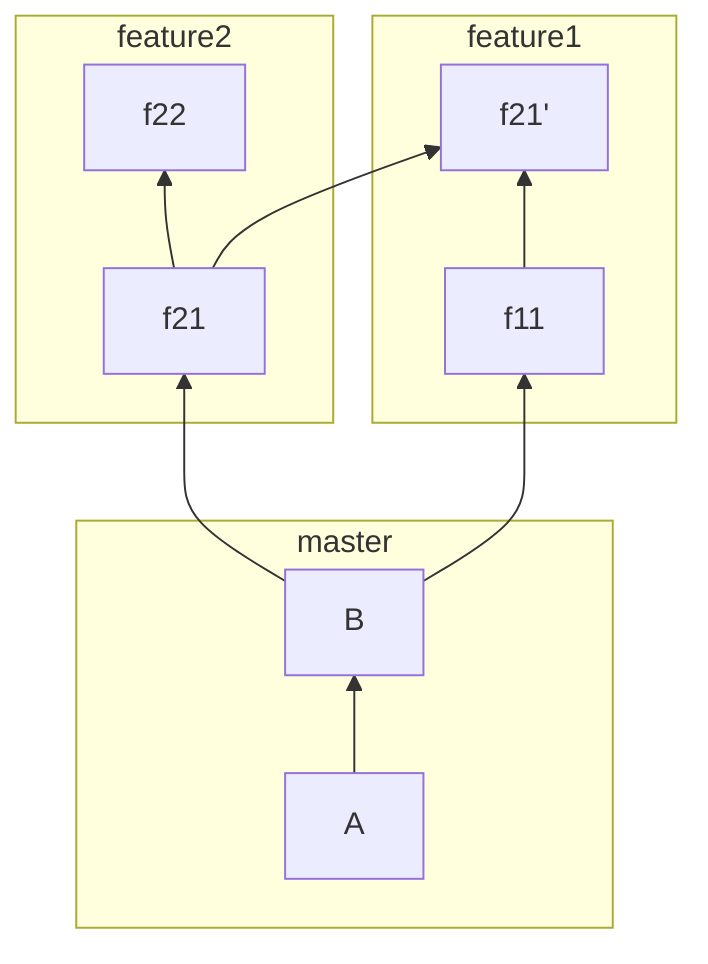

<details><summary>🚧Let's practice</summary>

```bash
# Let's create the situation we saw before: two branches, and in one branch we have
#     a commit that we need in the other.
git checkout -b feature/myOtherFeature main
echo -e "MyClass()\n" > MyClass.scala
git add .
git commit -m "Add class"
echo "Utilities()" > utils.scala
git add utils.scala
git commit -m "add utils"
# branch 2 (where we will need the utility)
git checkout -b feature/myOtherFeature2 main
echo -e "MyClass2()\n" > MyClass2.scala
git add MyClass2.scala
git commit -m "[+] MyClass2"
git logtree

# Now we will copy the commit from one branch to the other
git cherry-pick -x feature/myOtherFeature
git logtree
git show HEAD

# Like other commands, if we do something "strange" we need to fix it before
#     we can continue with this command
git reset --hard HEAD~1
echo -e "MyClass() extends SomeThing\n" > MyClass.scala
git add .
git commit -m "same class"
# The cherry-pick copies a commit, probably made from someone else, so if you cherry-pick
#     a commit, the author will be the same, but the commiter will be you.
git config user.name "Mr. X"
git cherry-pick -x feature/myOtherFeature~1
# This time we will edit and fix the cherry-pick, then use continue
git add .
git cherry-pick --continue
git logtree
git log --pretty=fuller -n 2
git config user.name "Eduardo Ruiz"
```
</details>

### 2.10 Branch integration (merge & rebase)


The [git merge] command joins two or more branches. Usually, you will only see a merge from two branches.
If we take a "deep" look to the merge commits you will se that we have more than one parent.
<details><summary>ℹ️⚡ℹ️ Synopsis</summary>

```bash
git merge [--no-commit] [--squash] [--ff | --no-ff | --ff-only]
          [-m <msg>] [<commit>...]
git merge (--continue | --abort | --quit)
```
</details>

The [git rebase] command move and/or manage a set of commits to another base.
If we have a branches A & B(HEAD), it is like we create A' as temporal branch
and take the commits from A, one by one, and apply a cherry-pick or amend over B,
then delete A and rename A' to A.

⚠️ This command rewrites the git history, so be careful.

<details><summary>ℹ️⚡ℹ️ Synopsis</summary>

```bash
git rebase [-i | --interactive] [--onto <newbase> | --keep-base]
           [--no-ff] [<upstream> [<branch>] | <branch>]
git rebase (--continue | --skip | --abort | --quit | --edit-todo | --show-current-patch)
```
</details>

Initial


Merge:


Rebase:


<details><summary>🚧Let's practice</summary>

```bash
# Let's make some modifications to explain the merge command
git checkout feature/myOtherFeature
echo -e "some code here...\n" >> MyClass.scala
git commit -am "some code"
# He updated a file, but this file is only in this branch,
#     so if we go to main this file does not exist.
git checkout main
ls -l
# The way we have being working, if we simply merge it will "fast-forward" merge.
# Let's not let this situation, so we can see common merges.
# We will explain this later if we have time.
git merge --no-ff feature/myOtherFeature
git logtree
ls -l
# As we can see in the log, a new commit was created from our branch to main.
#     This commit contains all of our changes
# Let's rollback this situation, because, like other commands, merge may result
#     in conflicting results... Let's see them and abort them
git reset --hard HEAD~1
echo "Some class" > MyClass.scala
git add .
git commit -m "some class"
git merge --no-ff feature/myOtherFeature
git merge --abort

# Another interesting argument is squash. This allow us to consolidate all our
#     commits into a single commit.
git merge --squash feature/myOtherFeature
git commit -m "merge feature/myOtherFeature -> main"
git logtree
ls -l

# Let's prepare main to see how rebase works
git reset --hard HEAD~1
echo "before rebase" >> README.md
git commit -am "before rebase"
# NOTE: while merge "brings" changes, rebase moves changes.
#     This means: if we want to merge something into main, our HEAD must be at main,
#     but if we want to rebase main, our HEAD must be at our branch.
git checkout feature/myOtherFeature2
git backup
git rebase main
# DONE!!
git logtree
# As we can see, now our branch is ahead of main, and we have the "same"
#     commits (we now have new hashes, committer is updated, etc)

# But why to use rebase if I still have to merge my branch into main?
#     Consider the situation of someone making an improvement or a fix and it is
#     already merged into main. A rebase helps you to test your code against
#     the last version, avoiding unused code, or fixing tests before merging.
git reset --hard backup/feature/myOtherFeature2
# In order to see conflicts while rebasing and show the risks and the potential
#     of this command we will merge feature/myOtherFeature into main
#### git rebase (--continue | --skip | --abort | --quit)
git logtree				### WATCH! deleted commit
git rebase -i main		### PICK + SQUASH
git logtree
```
</details>

----
----

## 3. Working with remotes


In this section we will see how to work in a team using git.

### 3.1 Cloning a remote repository

The [git clone] command copies a repository into a new directory.
Usually, the "remote" repository is called `origin`, but you can name it whatever you like.
Probably you will only use this command to download a repo from a remote repository to your local computer,
but it is also commonly used when you have to manage CI/CD[^CI/CD] pipelines.

<details><summary>ℹ️⚡ℹ️ Synopsis</summary>

```bash
git clone [-v | --verbose] [-l | --local]
          [--depth <depth>] [--[no-]single-branch] [--no-tags]
          [-o | --origin <name>] [-b | --branch <name>]
          [--] <repository> [<directory>]
```
</details>

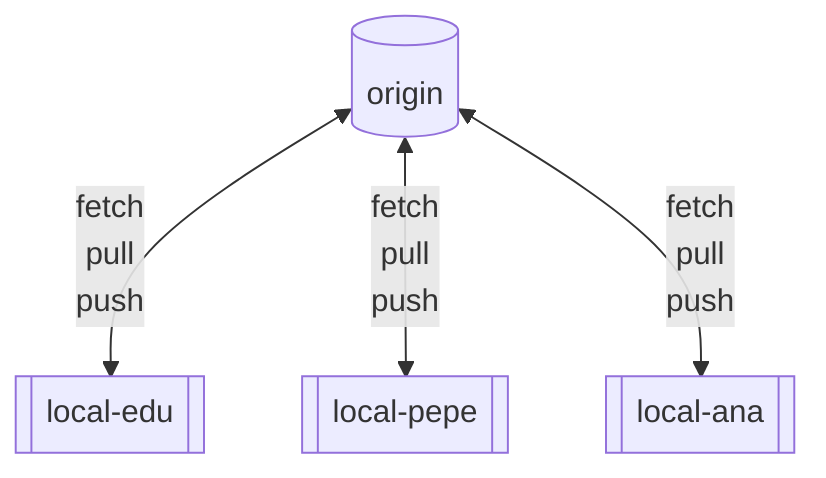

We will also take a look at [git remote] command, which let us manage links between local and remote repositories.

<details><summary>ℹ️⚡ℹ️ Synopsis</summary>

```bash
git remote [-v | --verbose]
git remote add [-t <branch>] [-f] [--[no-]tags] <name> <URL>
git remote rename <old> <new>
git remote remove <name>
git remote set-url --add [--push] <name> <newurl>
git remote set-url --delete [--push] <name> <URL>
git remote [-v | --verbose] show [-n] <name>...
```
</details>

Let's clone this very same repo and see the firsts commands we can use while working int a team.

```bash
cd ~/projects
git clone https://github.com/eruizalo/git-learning.git
cd git-learning
# How can I see where I cloned this repo?
git remote
# Let's see a bit more
git remote show origin
```

> ⚠️⚠️ **GitHub support for password authentication was removed on August 13, 2021.**:
> Let's create a Personal Token Access ([PAT]) following the official documentation.

### 3.2 Working with others 1 (fetching)

The [git fetch] command syncs your local and remote repositories, so if new tags or branches have been created or updated,
now will be visible and available to work with them.

<details><summary>ℹ️⚡ℹ️ Synopsis</summary>

```bash
git fetch [--all] [-v | --verbose]
         [--no-commit] [-e | --edit] [--ff-only]
         [--squash] [--autostash]
         [<repository> [<refspec>...]]
```
</details>

<details><summary>🚧Let's practice</summary>

```bash
# >>>>> Speaker will create a new branch
# Now we will use the git branch command using -a argument, to list all branches (local + remote)
git branch -a
# But I still see only my branch.. Why?
# Because the new branch was created after you cloned the repo, so your copy does not contain that reference
# If we fetch our remote now we will download 
git fetch     # As you can see here, git will warn us about new branches or other changes
# Now if we take a look again we can see the new branch
git branch -a
# Remember to use -a argument to list local & remote branches
git branch
# Or if you are only interested in remote branches use -r argument
git branch -r
# >>>>> Speaker will create a new commit
git fetch   # Here we also can see updated branches
```

</details>

Let's stop here, for now. Add this alias, and we will see how it works later.

> 🎁♻️ **_Cool alias:_** Not valid for current branch `git config --global alias.sync = fetch origin main:main`

### 3.3 Working with others 2 (pull-push)
The [git pull] command is used to sync and download content from a remote repository.
Under the hood, `git pull` is a making the following steps for you:
1. [git fetch]: Sync local & remote repo histories scoped to the local branch that `HEAD` is pointed at
2. [git merge] / [git rebase]: Git will reconcile the diverging branches (local/remote), if needed

<details><summary>ℹ️⚡ℹ️ Synopsis</summary>

```bash
git pull [--tags] [-v | --verbose]
         [--no-commit] [-e | --edit] [--ff-only]
         [--squash] [--autostash]
         [-r | --rebase[=false|true|merges|interactive]]
         [<repository> [<refspec>...]]
```
</details>

So let's say you have cloned some time ago a repo, you are at main but your team have been working on this repo (and you didn't).
Your main branch will be behind several commits. If you perform a `git pull` command it will `fetch` + `rebase` your main branch:
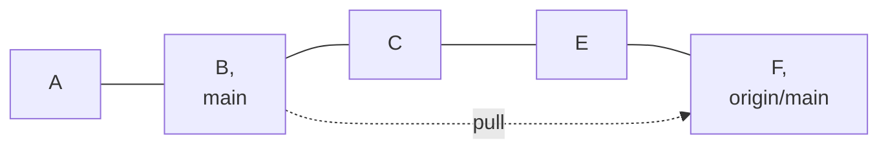
After (fast-forward):
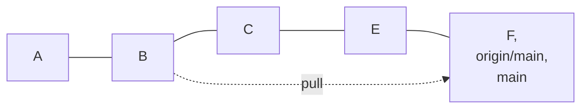

But, what would have happened if you have been working over your main branch, or you are on another branch, and you want to "sync" it with main?

Spoiler alert: it will fail until you specify how to reconcile the differences or set a default behaviour:
1. Merge: it will create a new merge commit (H), merging remote and local changes.
2. Rebase: it will put your changes over the remote changes, so your D commit will be moved over main, recreating this commit as D'

After (merge-commit):
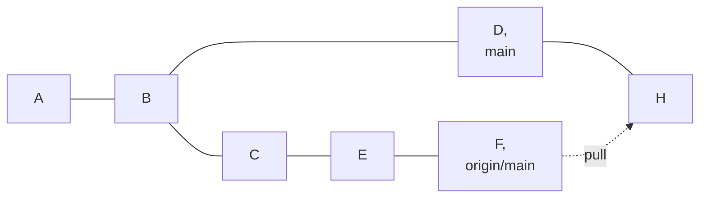

After (rebase):
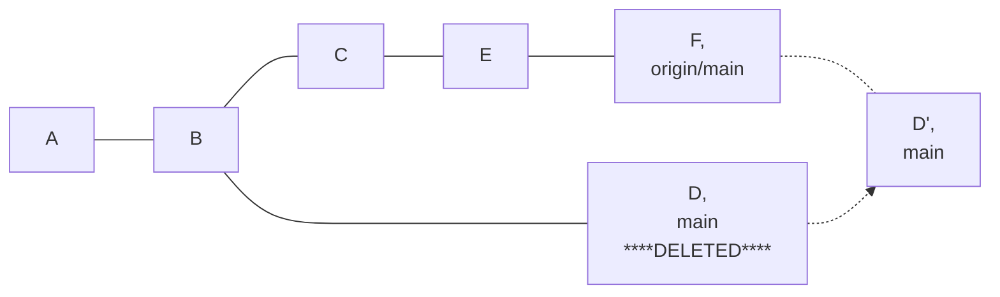

<details><summary>🚧Let's practice</summary>

```bash
# Let's simulate this situation using the previously created branch
# We will start creating a new local branch from the remote branch
git checkout -b testing origin/testing # As we saw before, we can create a new branch from other branches, the only difference here is we are creating this branch from a remote one
# >>>>> Speaker will create a new commit + push
git logtree
git pull      # Some interesting things happened here.
# 1. Changes were detected in our branch, that's why it says "Updating <COMMIT_1>..<COMMIT_2>
# 2. Fast forward: we saw it in the example above, but fast forwarding means git can simply reach the new commit by moving its pointer, without creating new references.
git logtree
# Now our local & remote branch are in the same reference and we can work safely

# Let's see the other situation.
# All of us will create a new commit
echo "I did this weeks ago" > some_file.txt
git add .
git commit -m "<MY NAME> some file"
git pull    # This failed?
# Yes, git does not know your preferences, so you must specify how to act, or save this preferences in your config (see hint comments after the command)
# Say we have a big git history graph and you do not know the status of your local main (or you don't care).
#     You just want to update your main, because you shouldn't have changes at main if they are not on the remote...
#     And if you have something, probably it should not be there (it could be a test you performed to see something, but you do not want to keep it)
#     This is very useful to keep in mind changes that "shouldn't" be there.
# In this case we will force pull to fast-forward or fail
git pull --ff-only
# As you and me made changes, it failed as we expected. In a normal project, you should act depending on the changes of your local and remote branches.

# For example, if we want to keep our changes we could use the merge flag.
# As you will see, it acts like it is a local branch and merges the changes (fetch + merge, as promised).
git pull --rebase=false
git logtree
# Let's rollback this changes so we can see the rebase flag
git reset --hard HEAD~1
# Nothing fancy, it acts like a local branch and rebase the changes (fetch + rebase, as promised as well)
git pull --rebase
git logtree


# WAIT!!!
# I know what you are thinking: why the f*ck did I start this sh$t!
# Or maybe you are thinking: Yeah, this is easy. Now we have just one shared branch and there are no changes on the fly.
#     But what if in our team there are 5 people, working on the same repo (different branches) and I want to keep the track of the main
#     branch as the merge while I work? Because I like rebase. Rebase is goooooood. Or someone force me to rebase.
#     Well, if you are working you probably didn't commit yet, but you see some changes when you fetch. So if you want to sync main
#     what would you do? Let me guess:
#     Stash or commit your changes, checkout main, pull main, checkout your branch, pop your stash or amend commit or whatever,
#     am I right (or close to)?
#     There is no need. Remember the last alias you added but we didn't explain? Let's see what it does:
# >>>>> Speaker will create a branch
git fetch testing2
git branch testing2
# >>>>> Speaker will create a new commit + push
git fetch
git logtree
# As we see, we are still on testing branch. Now we will make a change (not committed) and update the new branch, without leaving the current one
echo "hope this works, because if it doesn't I will lose it" > no_pain_no_gain.txt
git fetch origin testing2:testing2

# This is not necessary, but it seemed useful to me. Now that you know more and more about git, actually there are multiple options,
# in fact, you do not really need to sync your local main, because you could merge/rebase your local branch with the remote main.

# Or... you could merge/rebase simply another branch
# >>>>> Speaker will create a new branch + commit + push
git pull origin testing3
```
</details><br>

The [git push] command sends your local tracked changes to your remote/s.
This means, it updates the remote repository to match your local repository (the branch or tag you are pushing).

<details><summary>ℹ️⚡ℹ️ Synopsis</summary>

```bash
git push [--tags] [--porcelain] [-v | --verbose]
         [-f | --force] [-d | --delete]
         [<repository> [<refspec>...]]
```
</details>

Before git push
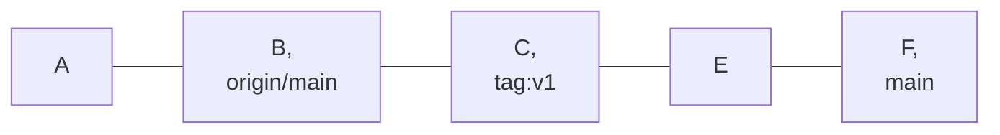
After git push:
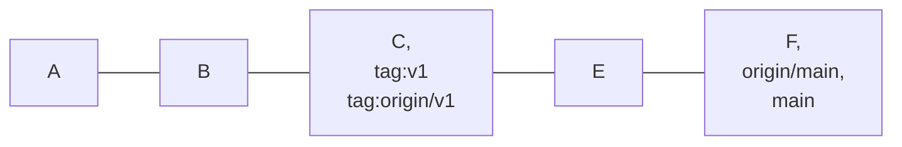

<details><summary>🚧Let's practice</summary>

```bash
git push
```
</details>

### 3.4 Pull Requests (PRs)
A Pull Request (PR), or Merge Request, is a web feature that lets you start the merging process from your branch or fork to the developing or production code.
Under the hood, it is a simple merge, but this feature provides useful tools you should use before merging:
1. Show differences to review the code changes
2. Show the commits that will be integrated
3. Prevents premature code to be merged
4. Perform some validations (CI/CD, merge strategy, code restrictions before integration)
5. Let our teammates collaborate and learn from our code (and we could learn from them)
6. There is an option that let us delete our branch after the merge (probably this branch is no longer useful) so we have a clean repository.

**Best practices**:
* You can create Pull Request templates if you are using [GitHub](https://docs.github.com/en/enterprise-server@3.3/communities/using-templates-to-encourage-useful-issues-and-pull-requests/creating-a-pull-request-template-for-your-repository) or [GitLab](https://docs.gitlab.com/ee/user/project/description_templates.html)
* Label your PR and add reviewers.
* Add a PR summary that helps other people what are you trying to merge
* If your PR is not finished, but you want to create it anyway, use draft/WIP Pull Requests
* I recommend you to associate your branch with a ticket/issue, but if you did not, you should associate your PR to your ticket/issue
* After a PR is merged, you should fetch + pull the target branch, and maybe delete your local source branch, as it has been already integrated and there is no need to keep it

<details><summary>🚧Let's practice</summary>

1. Create a local branch and make come changes
2. Add + commit + push
3. Go to your remote repository (now we will use our GitHub repo [https://github.com/hablatraining/git-learning/pulls])
4. Click the "New pull request" button
5. Select the source and target branches
6. Here the PR is not yet created, but we can see what the reviewers will se (we could review our commits and code, so we make sure it is ok before creating the PR)
   * If you do not want to create yet the PR, but you want someone to take a look, you could send the URL, and they could take a look at your changes (but they will not be able to comment or approve anything)
7. From the moment you create the PR your teammates will be able to comment on your PR, or even create new commits
8. Here we do not have any CI/CD workflow, but if we had, it would run now
</details>

### 3.5 Multiple remotes (forking)
When you fork a repository you are, in fact, cloning it, but not to your local machine, it is a server-side clone.
But, why to do so? There might be several reasons to fork, or not to fork, but the main reason could be to manage
the contributions without a complex permission management.

Imagine you are the one who owns a repository, and it is not private, as you want people to help you by contributing.
You will need to wait until someone reaches you, then you will grant access, but only to do certain things
(you do not want anyone to delete your code, or to grant other people access).
After a few years you have many people helping you, with different roles, some of them are not contributing anymore, so you should remove them...
And what it is worst, each one of them have between 1 and 5 branches, some of them are up-to-date, other ones are not, others simply are tests...
How would you clean up your repository?
With a fork-based develop you don't need to. You simply make your repo accessible to the people you may want, and they will fork it (server-side clone).
Those people will not have permission (or at least they shouldn't) to push or manages your repo, they will manage theirs, so if anyone wants to create a million of branches, they can do it without messing with your repository.
When someone develops a feature that wants to be integrated into the "main" code, that person will create a PR[^PR] and you (or your team) will accept or reject it.


When you work with forks you have to think that you are working with (at least) 3 repositories at the same time,
each one of them have their own history and restrictions:
1. The main repository, from where you created your fork.
   * You will have to clone this repository to your local, this remote is usually called `upstream`
   * Probably you won't be granted to do almost anything
2. Your forked repository, which it is a perfect copy, but it will be managed by yourself
   * You will have to clone this repository too, this one is usually called `origin`, as if it were a normal clone
   * You can do anything you want here (grant/restrict access to anyone, delete the repo, etc.)
3. Your local repository

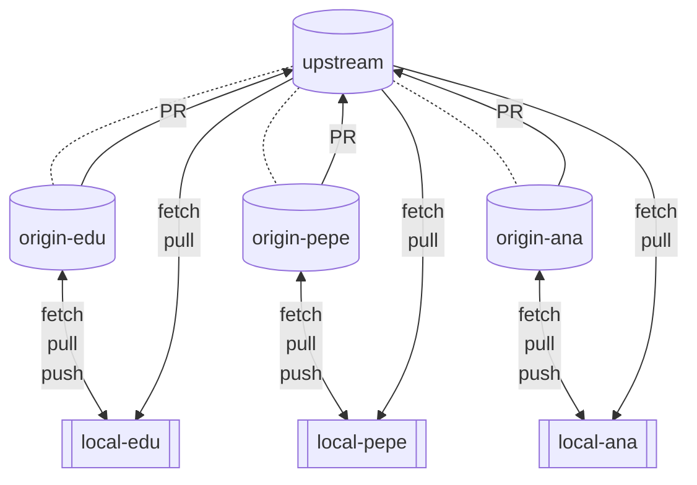

To sum up, you will usually have to do the following steps if you are working in a fork-based team:
1. Fork the "main" repo to your personal server-side space.
2. Clone your forked repo as `origin`
3. Clone the "main" repo as `upstream`
4. Manage your local branches (not necessary, but recommended):
   * Delete the branches you don't want, if there are any.
   * Change your "main" branches (master/main/develop) so their remotes are the `upstream` repository,
     * if you don't do this, when you pull a branch it will be pulling it from your `origin`, instead of `upstream`(which is the one everybody is contributing at)
     * you may not do this, if you specify where to pull from but...
     * why to keep your `origin` branches up to date when you are not using them? If you create a feature is a new branch, this one should be up-to-date, but not the rest of them
5. Create a new branch from `upstream`
6. Commit, merge, rebase or do anything you need to develop your feature
7. Push your branch to your fork (`origin`)
8. Create a pull request from `origin/your_branch` to `upstream/main_or_develop_branch`
9. The PR[^PR] gets approved and merged or changes will be requested (go to step 6, skip 8, as the PR[^PR] will be automatically updated)

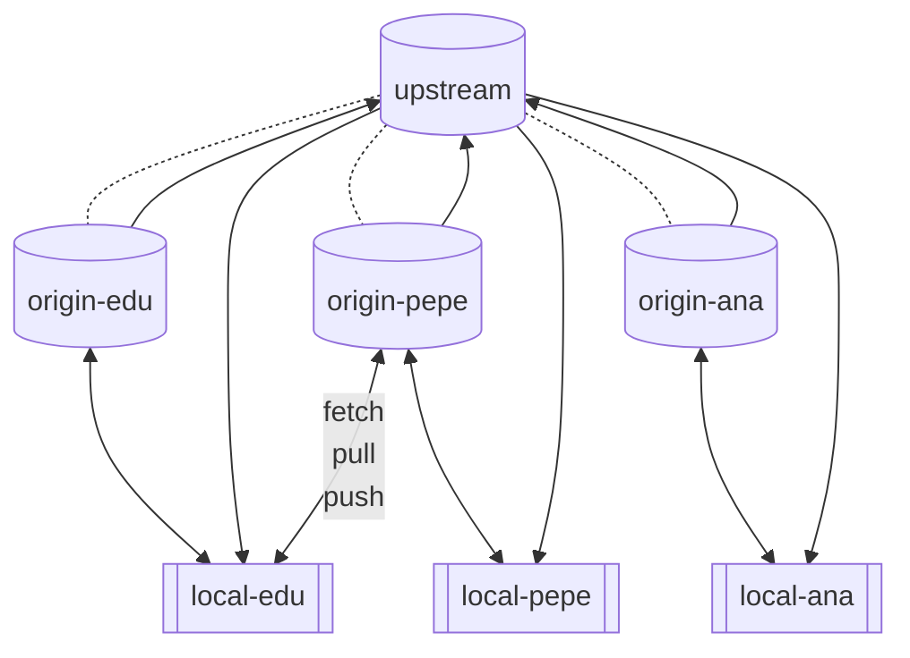
<details><summary>🚧Let's practice</summary>

```bash
git XXXX
```
</details>

### 3.6 Force push

<details><summary>🚧Let's practice</summary>

```bash
git push
```
</details>

### 3.7 Tracking your branches
```bash
# rename a pushed branch
# push branch 1 (local) to branch 2 (remote)
```


[^docker]: Docker is an open platform for developing, shipping, and running applications, letting us build an isolated environment, like a virtual machine. This way, all of us will have the same brand-new environment, where we can run our command safely.
[^CI/CD]: Continuous integration (CI) and continuous delivery (CD)
[^PR]: Pull Request

[docker]: https://docs.docker.com/get-docker/
[mermaid]: https://mermaid-js.github.io/
[PAT]: https://docs.github.com/en/authentication/keeping-your-account-and-data-secure/creating-a-personal-access-token

[git glossary]: https://www.git-scm.com/docs/gitglossary
[git config]: https://git-scm.com/docs/git-config
[git init]: https://git-scm.com/docs/git-init
[git commit]: https://git-scm.com/docs/git-commit
[git add]: https://git-scm.com/docs/git-add
[git status]: https://git-scm.com/docs/git-status
[git checkout]: https://git-scm.com/docs/git-checkout
[git rm]: https://git-scm.com/docs/git-rm
[git config alias]: https://git-scm.com/book/en/v2/Git-Basics-Git-Aliases
[git reset]: https://git-scm.com/docs/git-reset
[git diff]: https://git-scm.com/docs/git-diff
[git blame]: https://git-scm.com/docs/git-blame
[git log]: https://git-scm.com/docs/git-log
[git branch]: https://git-scm.com/docs/git-branch
[git merge]: https://git-scm.com/docs/git-merge
[git tag]: https://git-scm.com/docs/git-tag
[git stash]: https://git-scm.com/docs/git-stash
[git revert]: https://git-scm.com/docs/git-revert
[git cherry-pick]: https://git-scm.com/docs/git-cherry-pick
[git rebase]: https://git-scm.com/docs/git-rebase
[git clone]: https://git-scm.com/docs/git-clone
[git remote]: https://git-scm.com/docs/git-remote
[git fetch]: https://git-scm.com/docs/git-fetch
[git pull]: https://git-scm.com/docs/git-pull
[git push]: https://git-scm.com/docs/git-push
