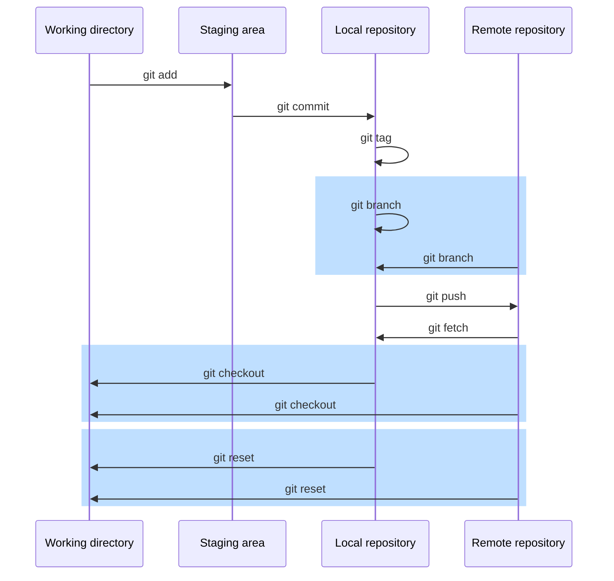
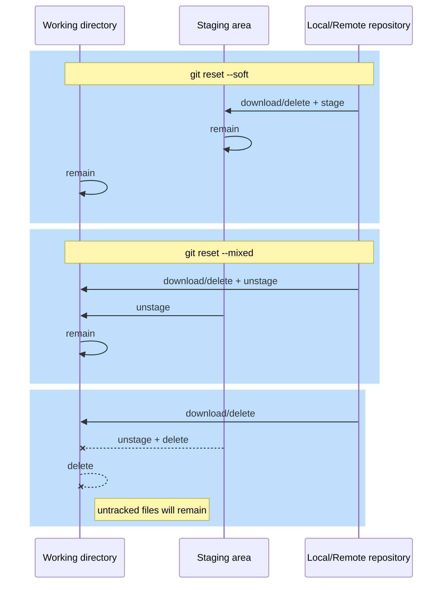

# git-learning


----
# Table of Contents
1. [Setting your environment](#settings)
2. [Working locally](#local)
   1. [Starting with git](#starting)
   2. [Tracking files](#tracking-files)
   3. [Log & alias](#log-alias)
   4. [HEAD, relative references & branch creation and repositioning](#head-branching)
   5. [Stashing](#stashing)
   6. [Rollback changes](#rollback)
   7. [Amending](#amending)
   8. [Cherry picking](#cherry-picking)
   9. [Branch integration (merge & rebase)](#merge-rebase)
3. [Working with remotes](#remotes)
----
## 0. Cheatsheet
We use some [mermaid] graphs, only visible in GitHub (you will see only code in local)
<!--https://mermaid-js.github.io/mermaid-live-editor-->


## 1. Setting your environment<a name="settings"></a>


We will use docker, so we can have the same isolated environment:
```bash
cd docker/
docker build -t training/git .
docker run -it -d -v $(pwd)/git-volume/:/root/projects/ --name learning-git training/git:latest
docker exec -it learning-git bash
```
Now, inside your docker, got to **projects/local** folder: `cd projects/local`

----

## 2. Working locally<a name="local"></a>

### 2.1 Starting with git<a name="starting"></a>


<details>
<summary>Command summary</summary>
Let's see [git config] command
</details>

```bash
ls -l
# We should have an empty folder, create a new one if you want
git config --global init.defaultBranch main
git config --global user.email eduardo.ruiz@hablapps.com
git config --global user.name "Eduardo Ruiz Alonso"

git config --list

git init
echo -e "# This is my git project\n" > README.md
echo -e "Cheatsheet: https://devhints.io/git-log-format\n\n" >> README.md
git add .
git commit -m "Initial commit"

git config user.email eduardo.ruiz@hablapps.com
git config user.name "Eduardo Ruiz"

git config --list --show-origin
```

### 2.2 Tracking files<a name="tracking-files"></a>

```bash
echo "this is a test" > test.txt
git status
echo "-----" >> README.md
git add test.txt
git status

git commit -a -m "commit 2"   ## -a ==> ONLY TRACKED FILES
git status

touch .gitignore
touch .testing
git status
git add .gitignore
echo ".*" >> .gitignore
git status
mkdir secrets
touch secrets/secret1.txt
touch secrets/secret2.txt
git status
git status -u
git status -u -s
echo "secrets/*" >> .gitignore
git status
git commit -am "gitignore"
```

What if I am already tracking a file I do not want to track?
```bash
touch script.sh
git add .
git commit -m "add script"
echo "*.sh" >> .gitignore
git commit -am "ignore sh"
echo "#bash" >> edu.sh
git status
git checkout .
git rm --cached edu.sh
git status
ls -l
git commit -m "untrack script.sh"
echo "#bash" >> edu.sh
git status
```

### 2.3 Log & alias<a name="log-alias"></a>
```bash
echo "Something" >> README.md
git add .
git config --global alias.unstage 'reset --'
git config --global alias.discard 'checkout --'
git config --global alias.untrack 'rm --cached'
git config --global alias.stats 'status -s'

git stats
git unstage README.md
git stats
git discard README.md
git stats

git log
git log -n 1
git config --global alias.logtree "log --graph --abbrev-commit --decorate --format=format:'%C(bold blue)%h%C(reset) - %C(bold cyan)(%ar|%cr)%C(reset) %C(bold yellow)%d%C(reset) %C(white)%s%C(reset) %C(dim green)- %an%C(reset)' --all"
git logtree
```

### 2.4 HEAD, relative references & branch creation and repositioning<a name="head-branching"></a>

```bash
git branch branch1
git branch
git checkout branch1
git branch
git checkout -b branch2
git branch
git logtree

echo "commit 3" >> README.md
git add .
git commit -am "commit 3"
git checkout branch1

echo "commit 4" >> tests.txt
git add .
git commit -am "commit 4"
git merge branch2
git logtree

git branch ref
git branch -f main ref
git logtree
git checkout main
git branch -f ref HEAD~1
git branch -f refParen1 main^1
git branch -f refParen2 main^2
git logtree

git branch newBranch commit_hash
git logtree

git tag v0.0.2
git tag v0.0.1 main~3
git tag
git branch release/v0.0.1 v0.0.1
git logtree
```

### 2.5 Stashing<a name="stashing"></a>

```bash
git checkout -b feature/myFeature
echo "some changes" >> README.md
git checkout main
git commit -am "main changes"
git checkout feature/myFeature
echo "other changes" >> README.md
git checkout main           # <----this will fail
git stats
git stash
git stash list
git stats
git checkout main

git checkout feature/myFeature
git stash pop stash@{0}
git stash list
git stash
git stash apply stash@{0}
git stash list
git stash -m "WIP feature my stash"
git stash list
git stash show stash@{0}
git stash show -p
```

### 2.6 Rollback changes<a name="rollback"></a>

```bash
echo -e "\n\nthis will not fail\n" >> README.md
git commit -am "this will not fail"
echo -e "\n\nbut this one will\n" >> README.md
git commit -am "but this one will"
git logtree
git revert HEAD
git revert <COMMIT_ID HEAD - 2>
git logtree
git checkout main
git revert <COMMIT_ID HEAD - 2>
#### git revert (--continue | --skip | --abort | --quit)
git checkout feature/myFeature
git logtree
git reset --soft HEAD~3
git logtree
git status -vv
git commit -am "this too 2"
git reset --mixed HEAD~1
git logtree
git status -vv
git commit -am "this too 3"
git reset --hard HEAD~1
git logtree
git status -vv
git reset --hard main
git logtree
git reset --hard <COMMIT ID DELETED BRANCH>
git logtree
```



### 2.7 Amending<a name="amending"></a>

```bash
echo -e "\nDis is som text\n" >> README.md
git commit -am "Fixing readme"
git logtree
head -n -3 README.md > README.md
echo -e "\nThis is some text\n" >> README.md
git logtree
git commit -am "Fixing readme" --amend
git logtree

git config user.name "Mr. X"
git commit -am "Fixing readme 2" --amend
git log --pretty=fuller -n 2
```

### 2.8 Cherry picking<a name="cherry-picking"></a>

```bash
git checkout -b feature/myOtherFeature main
git logtree
echo -e "MyClass()\n" > MyClass.scala
git add .
git commit -m "Add class"
echo "Utilities()" > utils.scala
git add utils.scala
git commit -m "add utils"

git checkout -b feature/myOtherFeature2 main
git logtree
echo -e "MyClass2()\n" > MyClass2.scala
git add MyClass2.scala
git commit -m "[+] MyClass2"
git logtree
##### echo -e "MyClass2() extends Utilities\n" > MyClass2.scala

git cherry-pick <COMMIT ID OTHER BRANCH>
#### git cherry-pick (--continue | --skip | --abort | --quit)
git logtree
git log --pretty=fuller -n 2
git config user.name "Eduardo Ruiz"
echo -e "MyClass2() extends Utilities\n" > MyClass2.scala
git commit -am "extends"
```

### 2.9 Branch integration (merge & rebase)<a name="merge-rebase"></a>

```bash
git checkout feature/myOtherFeature
echo -e "some code here...\n" >> MyClass.scala
git commit -am "some code"
git branch backup/feature/myOtherFeature feature/myOtherFeature
git checkout main
ls -l
git merge --no-ff feature/myOtherFeature
#### git merge (--continue | --skip | --abort | --quit)
git logtree
ls -l
git reset --hard HEAD~1
git logtree

git merge --squash feature/myOtherFeature
git commit -m "merge feature/myOtherFeature -> main"
git logtree
ls -l

git reset --hard HEAD~1
git checkout feature/myOtherFeature2
git rebase main
#### git rebase (--continue | --skip | --abort | --quit)
git logtree				### WATCH! deleted commit
git rebase -i main		### PICK + SQUASH
git logtree
```

Initial


Merge:


----
----
## 3. Working with remotes<a name="remotes"></a>


1. Go to **projects/remotes** folder: `cd ~/projects`
2. Clone the repo: `git clone https://github.com/eruizalo/git-learning.git`
   1. This will have downloaded all the git history of this repository in a **new folder**
3. Go to the new folder: `cd git-learning`
4. Check our remotes: `git remote`
4. Let's see a bit more: `git remote show origin`

### 3.1 Fetching + sync main<a name="fetching"></a>

### 3.2 Multiple remotes (forking)<a name="forking"></a>

### 3.3 Working with others<a name="pull-push"></a>

### 3.4 Force push<a name="force-push"></a>

### 3.5 Tracking your branches<a name="tracking-branches"></a>
```bash
# rename a pushed branch
# push branch 1 (local) to branch 2 (remote)
```

### 3.6 Pull Requests (PRs)<a name="force-push"></a>


[mermaid]: https://mermaid-js.github.io/
[git config]: https://git-scm.com/docs/git-config
[git init]: https://git-scm.com/docs/git-init
[git commit]: https://git-scm.com/docs/git-commit
[git add]: https://git-scm.com/docs/git-add
[git status]: https://git-scm.com/docs/git-status
[git checkout]: https://git-scm.com/docs/git-checkout
[git rm]: https://git-scm.com/docs/git-rm
[git config alias]: https://git-scm.com/book/en/v2/Git-Basics-Git-Aliases
[git reset]: https://git-scm.com/docs/git-reset
[git log]: https://git-scm.com/docs/git-log
[git branch]: https://git-scm.com/docs/git-branch
[git merge]: https://git-scm.com/docs/git-merge
[git tag]: https://git-scm.com/docs/git-tag
[git stash]: https://git-scm.com/docs/git-stash
[git revert]: https://git-scm.com/docs/git-revert
[git cherry-pick]: https://git-scm.com/docs/git-cherry-pick
[git rebase]: https://git-scm.com/docs/git-rebase
[git clone]: https://git-scm.com/docs/git-clone
[git remote]: https://git-scm.com/docs/git-remote
[git fetch]: https://git-scm.com/docs/git-fetch
[git push]: https://git-scm.com/docs/git-push
